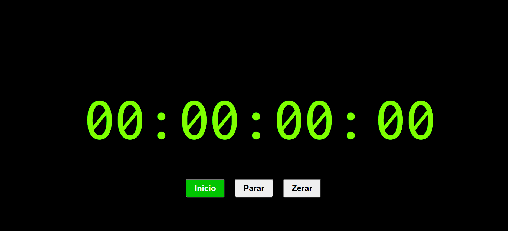
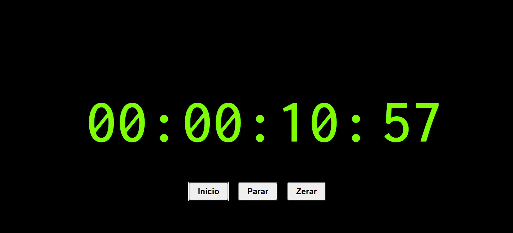
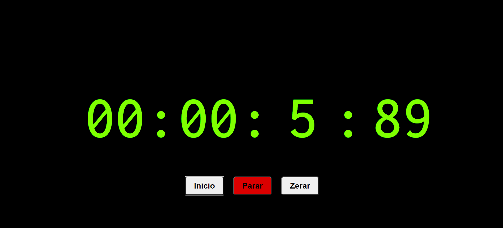
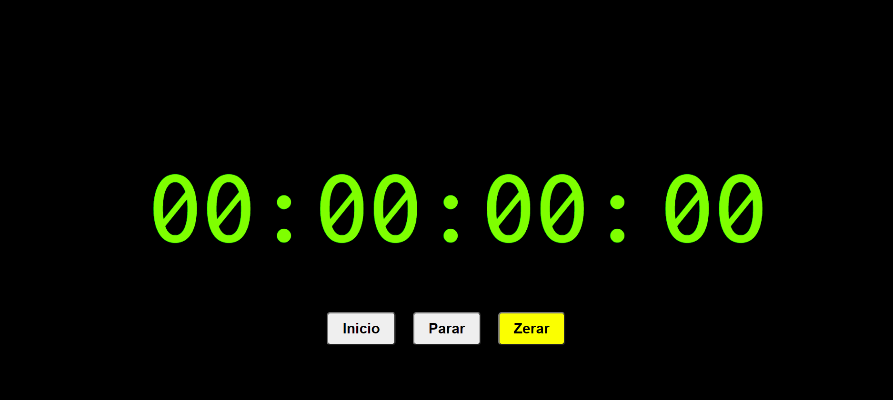

# CRONÔMETRO COM HTML, CSS E JavaScript

## Descrição do projeto:
Este é um exercício prático com algumas funções do JavaScript como o setInterval e o clearInterval

### Features
- [x] Start
- [x] Stop
- [x] Reset
- [ ] Lap

## Métodos:
##### Para iniciar a contagem:
| start( ); | 
---------

-- Quando o botão <i>"Iniciar"</i> do <b>html</b> é pressionado esse método é invocado e verifica através de uma condicional <b><i>if</i></b> se o cronometro está ligado através da variável "var ligado" que por padrão inicia com o valor <b>booleano</b> <i>false</i>. 

-- Ou seja, se o cronômetro estiver ativo a variável "ligado" retornará true, se não, false.

-- Se a variável "var ligado" estiver como false, será atribuído a uma outra variável chamada "var intervalo" o valor da função <b>setInterval( )</b>, que recebe como parâmetro a função <b>inicioRelogio( )</b> e um valor de 10, que corresponde ao valor em milisegundos em que a lógica dentro da função <b>inicioRelogio( )</b> se repitirá. 

---------------------------------------------------

##### Método de contagem:
| inicioRelógio( ) |
--------------------
-- Começa com o acréscimo na variável "centesimos" (<b>centesimos++</b>) e segue, define a variavel "ligado" como true, imprime na tela o valor de centesimos no campo identificado no html;

-- Faz uma verificação com um condicional <i><b>if</b></i> e define que quando o valor de centesimos for maior ou igual a 99 será feita a adição da variável segundo (<b>segundo++</b>) e imprimirá na tela o valor dessa variável correspondente a casa dos segundos no html.

-- No campo dos segundos a verificação é feita até o número chegar a 59, e então é feita uma adição na variável minuto (<b>minuto++</b>) e imprimirá na tela o valor dessa variável correspondente a casa dos minutos no html. 
Dessa mesma forma é feita com a variável das horas, porém sem limite de adição. 

--------------------------------------------------------------
##### Método de parar contagem:
| stop( ) |
-----------

-- Prieiramente é atribuído o valor padrão (false) para a variável ligado; é invocada a função <b>clearInterval()</b> que recebe como parâmetro a variável <b>intervalo</b>, que anteriormente foi definida com o valor da função <b>setInterval(inicioRelogio, 10);</b> por fim é definido um valor <i>null</i> a variável intervalo. O que faz com que a contagem pare.

---------------------------------------------------------------

##### Método de zerar contagem:
| zero( ) |
-----------

-- Esse método redefine todas as variáveis: hora, minuto, segundo e centesimos para zero. Imprime na tela o valor "00" em string.
Esse método não para a contagem.

-----------------------------------------------------------------

##### Links de consultas:
- [setInterval](https://www.w3schools.com/jsref/met_win_setinterval.asp)
- [clearInerval](https://www.w3schools.com/jsref/met_win_clearinterval.asp)